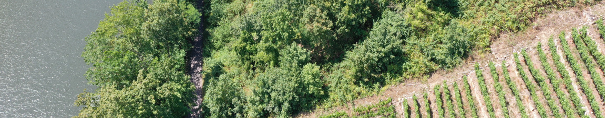
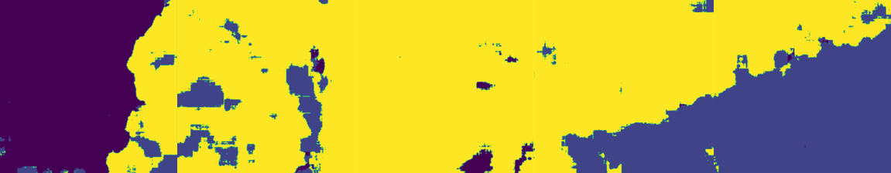

# Vineyard-Segmentation
Automatic segmentation by cultivation status of vineyards.

## About The Project
This program is built on the Keras framework and uses drone imagery of vineyards to train a U-Net model for automatically identifying the status of farmland. It utilizes a single GPU as the computation tool, enabling the detection of various conditions, such as cultivated vineyards, abandoned fields, large-scale landslides, and more.

## Outlines

* [Build With](#build-with)
* [Getting Started](#getting-started)
  * [Recommended User-Ajustable Parameters of Main.py](#recommended-user-ajustable-parameters-of-mainpy)
  * [Program Structure](#program-structure)
    * [Main Program Structure](#main-program-structure)
    * [Unet-Model Subprogram Structure](#unet-model-subprogram-structure)
* [Known Issues](#known-issues)
* [Reference](#reference)

## Build With

Python (3.9.18)
* Deep Learning Framework:
    * TensorFlow (2.17.0)
    * Keras 
* Image Processing and Segmentation Libraries:
    * NumPy (1.26.4)
    * OpenCV (4.10.0.84)
    * PIL(Python Imaging Library) (10.4.0)
    * Patchify (0.2.3)
    * Segmentation Models(sm) (1.0.1)
* Visualization:
    * Matplotlib (3.9.1)
* Data Processing:
    * Scikit-learn (1.5.1)
* Additional Utility Libraries:
    * JSON
    * OS
    * SYS
    * Random

## Getting Started 
This repository contain two code files. The main program executes by calling the Unet-model subprogram. You can either go directly to the[Recommended User-Ajustable Parameters of Main.py](#recommended-user-ajustable-parameters-of-mainpy) for implementation, or read the [Program Structure](#program-structure) to learn more about the program's architecture.

[Back to Outlines](#outlines)

### Recommended User-Ajustable Parameters of Main.py
* Specify the node (line 34, 38)
* Dataset (line 69)
* Patch_size (line 70)
* Labels (line 185~209, 241)
* Ratio of Training-Testing dataset (line 246)
* Weight (line 256)
* Batch_size (line 280)
* Epoch (line 282)

[Back to Outlines](#outlines)

### Program Structure
The program structure will introduce the workflow of the main program and the sub-programs. For a more detailed explanation of the program, please refer to the comments in the code.

#### Main Program Structure
1. MultiWorkerMirroredStrategy Environment Setup:
Ensure the current directory is in the system path.
Set the CUDA_VISIBLE_DEVICES environment variable to specify GPU usage.
Configure TensorFlow’s TF_CONFIG for distributed training using MultiWorkerMirroredStrategy.
Define the MultiWorkerMirroredStrategy for distributed training across workers.

2. Libraries Import:
Load libraries such as TensorFlow, OpenCV, NumPy, Matplotlib, and the segmentation model library (segmentation_models).

3. Image Preprocessing:
Load and crop images from the JPEGImages folder to dimensions that are multiples of 1024.
Patchify the images (divide them into smaller patches of size 1024x1024) and scale the pixel values between 0 and 1.
Append the processed images to the dataset.

4. Mask Preprocessing:
Similarly, load and crop segmentation masks from the SegmentationClass folder.
Patchify and process the masks, converting them into usable format for training.

5. Label Encoding:
Convert the RGB values in the masks to integer labels representing different classes (e.g., background, cultivated vineyard, etc.).
Expand the labels from 3D to 4D for input into the model.

6. Dataset Splitting:
Split the dataset into training (80%) and testing (20%) groups.
Apply one-hot encoding to the labels.

7. Model Compilation:
Define a custom Unet model for segmentation using the multi_unet_model function.
Compile the model with Adam optimizer, combined dice and focal loss, and metrics including accuracy and Jaccard coefficient.

8. Model Training:
Train the model using MultiWorkerMirroredStrategy to distribute the training across multiple workers.
Set a batch size of 12 and train for 100 epochs.

9. Save the trained model:
Save the trained model to a file in HDF5 format. 

10. Prediction and Output:
After training, make predictions on the test dataset.
Save the predicted images along with ground truth and test images in an output_images folder.

[Back to Outlines](#outlines)

#### Unet-Model Subprogram Structure
1. Import Libraries:
Necessary libraries are imported, including Keras and TensorFlow modules such as Input, Conv2D, MaxPooling2D, UpSampling2D, concatenate, and others from Keras, as well as backend from TensorFlow for custom functions.

2. Define Jaccard Coefficient (jacard_coef function):
This function calculates the Jaccard Coefficient (or Intersection over Union) between true and predicted segmentation masks. It flattens both the true and predicted values and computes their intersection and union, returning the Jaccard score.

3. Model Function: multi_unet_model:
    * Inputs: Takes input dimensions (IMG_HEIGHT, IMG_WIDTH, IMG_CHANNELS) and number of output classes (n_classes), defining the shape of the input tensor.
    * Contraction Path (Downsampling):
        * Several blocks of convolutional layers are defined, with each block consisting of:
            * A 2D convolution with ReLU activation and kernel initialization.
            * Dropout layers to avoid overfitting.
            * Max Pooling layers for downsampling, halving the resolution each time.
        * The contracting path has five convolutional blocks (c1, c2, c3, c4, c5) with increasing depth, starting from 16 filters and doubling after each layer until 256 filters are reached in the bottleneck (c5).
    * Bottleneck:
        * The middle layer contains two convolutional layers with 256 filters, followed by a Dropout layer. This is the deepest layer of the UNet model.
    * Expansion Path (Upsampling):
        * The upsampling path uses Conv2DTranspose layers to upsample the feature maps, concatenating with corresponding layers from the contracting path (i.e., using skip connections).
        * Convolutional layers follow each upsampling operation to refine the features after each upsampling.
        * This part mirrors the contracting path, reducing the number of filters symmetrically back down to 16 filters (c6, c7, c8, c9).
    * Output Layer:
        * A final Conv2D layer with a softmax activation produces the output, generating n_classes segmentation maps, one for each class.

4. Model Construction and Return:
    * The input and output layers are defined in the model. The model is built without being compiled, allowing the user to compile it later with custom loss functions and optimizers in the main program.
    * The function multi_unet_model returns the constructed UNet model.

[Back to Outlines](#outlines)

## Known Issues
1. Model Loading Under Development
The current version of the program supports dataset loading, training on the dataset, saving trained models, and generating Inferential images. However, the functionality to load pre-trained models and directly utilize them for inference is still under development and not yet fully operational.

2. Memory Overload with Large Datasets
When dealing with large datasets, there is a potential risk of memory overload during processing, which may result in the program failing to execute as expected. Users are advised to monitor memory usage and consider using smaller datasets or implementing data batching strategies to mitigate this issue.

3. Incomplete Multi-GPU Support with TensorFlow MultiWorkerMirroredStrategy
The program successfully utilizes TensorFlow's MultiWorkerMirroredStrategy to speed up training on a single node with a single GPU. While multiple GPUs across different nodes can currently communicate and initialize properly, full synchronization and multi-GPU parallelism have not yet been achieved. As a result, multi-node GPU training is not yet fully supported.

4. Color Discrepancies in Mask Preview and Test Label Images:
The colors of the mask preview after label encoding, as well as the test label image in the center of the final output, are not yet calibrated. This does not impact the functionality of the program, but the visual representation may appear inconsistent.

[Back to Outlines](#outlines)

## Reference
Ronneberger, O., Fischer, P., & Brox, T. (2015). U-net: Convolutional networks for biomedical image segmentation. In Medical image computing and computer-assisted intervention–MICCAI 2015: 18th international conference, Munich, Germany, October 5-9, 2015, proceedings, part III 18 (pp. 234-241). Springer International Publishing.

Bhattiprolu, S. (2023). python_for_microscopists. GitHub. https://github.com/bnsreenu/python_for_microscopists/tree/master/228_semantic_segmentation_of_aerial_imagery_using_unet

TensorFlow. (n.d.). Multi-worker training with Keras. TensorFlow. https://www.tensorflow.org/tutorials/distribute/multi_worker_with_keras

[Back to Outlines](#outlines)